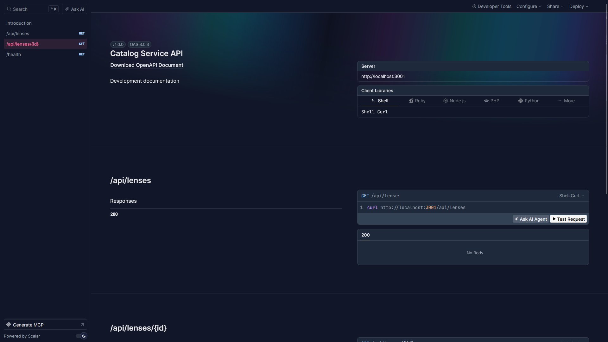
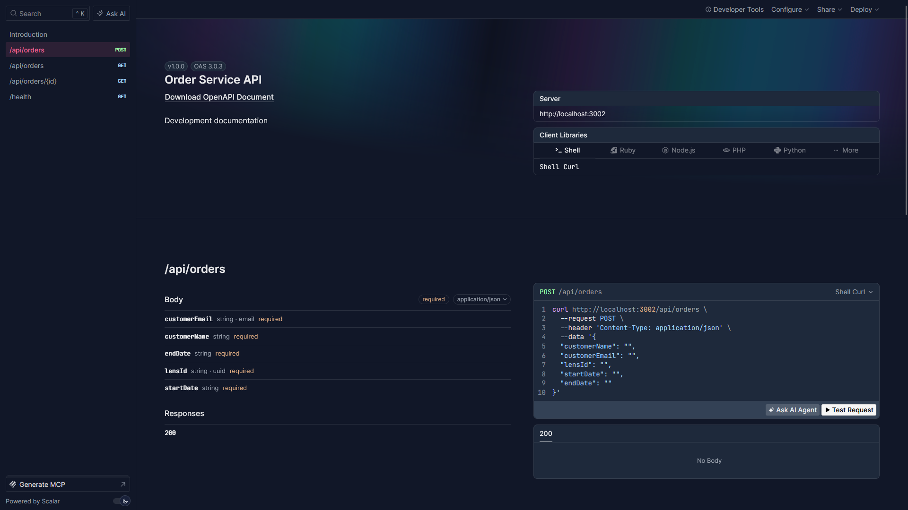
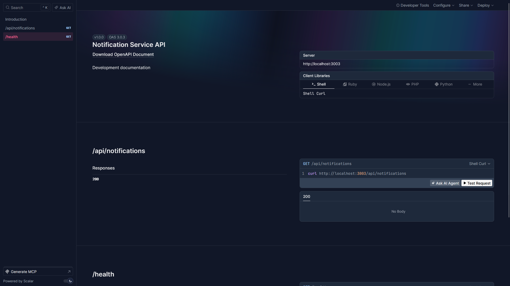
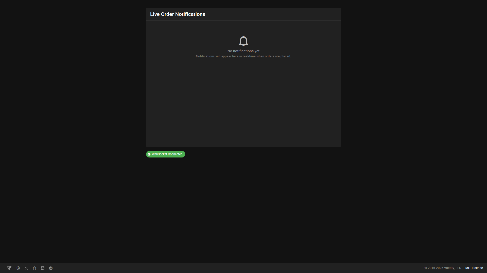
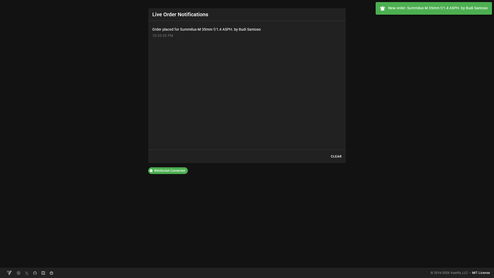
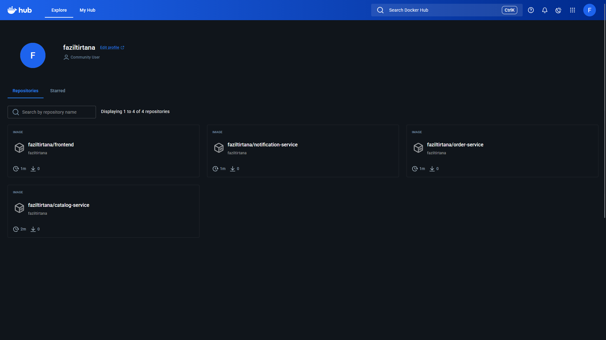
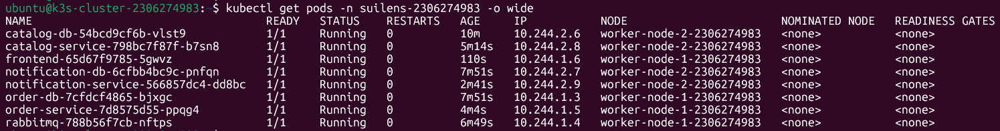

# A03 – API and Kubernetes Deployment

Nama: Muhammad Fazil Tirtana  
NPM: 2306274983  

---

## 1. Deskripsi Tugas

Pada tugas ini saya melakukan beberapa hal utama:

1. Mengimplementasikan dokumentasi OpenAPI pada aplikasi suilens
2. Mengimplementasikan WebSocket untuk notifikasi realtime
3. Melakukan build image dan push ke Docker Hub
4. Membuat Kubernetes cluster dengan 1 control plane dan 2 worker node
5. Melakukan deployment aplikasi ke dalam namespace Kubernetes
6. Menjalankan aplikasi menggunakan image dari Docker Hub

Aplikasi terdiri dari beberapa service:

- catalog-service
- order-service
- notification-service
- frontend
- postgres database (3)
- rabbitmq

Semua service berhasil dijalankan di dalam Kubernetes cluster.

---

## 2. Implementasi OpenAPI

Dokumentasi OpenAPI diimplementasikan pada setiap service backend menggunakan Swagger.

Endpoint dokumentasi:

- `/swagger`

Service yang memiliki dokumentasi:

- catalog-service
- order-service
- notification-service

### Catalog Service



### Order Service



### Notification Service



Dokumentasi ini menampilkan seluruh endpoint, request body, response, dan schema.

---

## 3. Implementasi WebSocket

WebSocket diimplementasikan pada notification-service untuk memberikan notifikasi secara realtime ke frontend ketika order baru dibuat.

Alur proses:

1. User melakukan POST order melalui frontend
2. order-service mengirim event ke RabbitMQ
3. notification-service menerima event dari RabbitMQ
4. notification-service mengirim notifikasi melalui WebSocket
5. frontend menerima notifikasi tanpa perlu refresh halaman

Pengujian dilakukan menggunakan smoke test pada README suilens dengan:

```

customerName = Muhammad Fazil Tirtana
customerEmail = [2306274983@gmail.com](mailto:2306274983@gmail.com)

```

### Sebelum melakukan POST order



Pada kondisi ini belum ada notifikasi, namun koneksi WebSocket sudah aktif.

### Setelah melakukan POST order



Setelah order dibuat, notifikasi langsung muncul pada frontend tanpa reload halaman, menandakan WebSocket berhasil berjalan dengan benar.

---

## 4. Docker Hub

Semua service di-build menjadi image dan di-push ke Docker Hub.

Repository:

https://hub.docker.com/u/faziltirtana

Image yang digunakan:

- faziltirtana/catalog-service
- faziltirtana/order-service
- faziltirtana/notification-service
- faziltirtana/frontend

Screenshot Docker Hub:



---

## 5. Kubernetes Cluster

Cluster dibuat menggunakan AWS EC2 dengan konfigurasi:

| Node | Role |
|------|--------|
| k3s-cluster-2306274983 | control plane |
| worker-node-1-2306274983 | worker |
| worker-node-2-2306274983 | worker |

Cluster menggunakan:

- containerd
- kubeadm
- flannel network
- metallb

Namespace yang digunakan:

```

suilens-2306274983

```

---

## 6. Deployment ke Kubernetes

Aplikasi dideploy menggunakan image dari Docker Hub.

Service yang dijalankan:

- catalog-db
- order-db
- notification-db
- rabbitmq
- catalog-service
- order-service
- notification-service
- frontend

Semua pod berjalan dengan status Running.

Command:

```

kubectl get pods -n suilens-2306274983 -o wide

```

Screenshot:



---

## 7. Arsitektur Aplikasi

Arsitektur aplikasi menggunakan microservices.

Frontend → order-service  
Frontend → catalog-service  
order-service → rabbitmq  
notification-service → rabbitmq  
service → postgres  

Semua service saling terhubung menggunakan Kubernetes Service.

---

## 8. Repository

GitHub:

https://github.com/faziltirtana/a03-suilens

Docker Hub:

https://hub.docker.com/u/faziltirtana

---

## 9. Kesimpulan

Pada tugas ini saya berhasil:

- Mengimplementasikan OpenAPI
- Mengimplementasikan WebSocket realtime
- Melakukan build image Docker
- Push ke Docker Hub
- Membuat Kubernetes cluster
- Deploy aplikasi ke namespace Kubernetes
- Menjalankan semua service dengan status Running

Semua requirement tugas berhasil dipenuhi.
